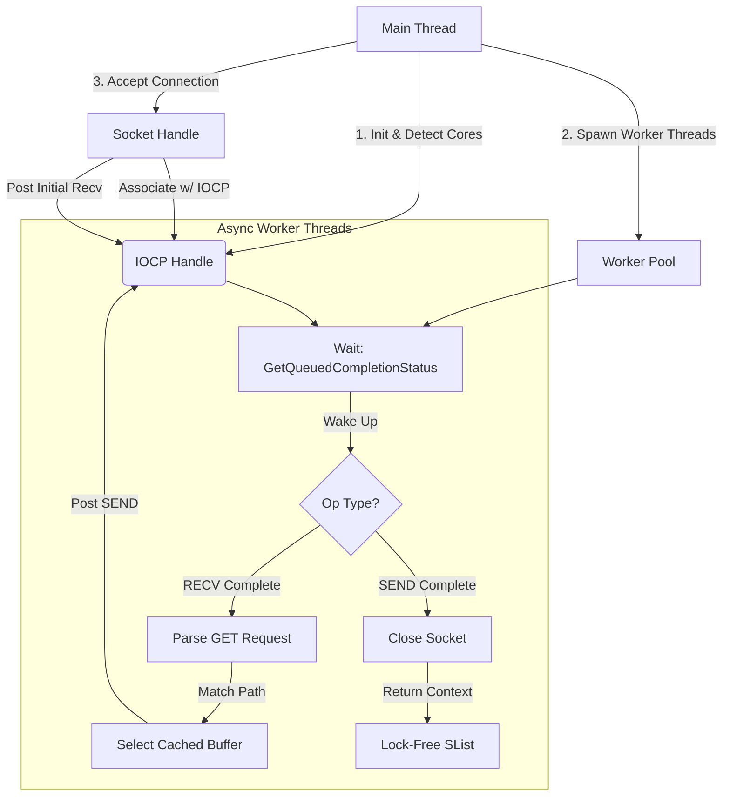

# Win64-httpdLite

**Win64-httpdLite** is a high-performance, asynchronous HTTP server implemented entirely in **x64 Assembly (MASM)** for the Windows platform.

This project demonstrates systems programming concepts by stripping away high-level abstractions to interact directly with the OS kernel. It leverages the Windows **I/O Completion Port (IOCP)** engine—the standard for scalable Windows networking—to achieve efficient concurrency with minimal resource overhead.

> **Note:** This project is a fork and evolution of **[Win64-echod](https://github.com/Deadlici0us/Win64-echod)**, expanding the original TCP echo server into a fully functional HTTP server.

---

## ⚡ Technical Highlights

### 1. Asynchronous I/O (IOCP)
The server utilizes the **Proactor Pattern** via Windows I/O Completion Ports to handle concurrent connections efficiently.
*   **Scalability:** A fixed thread pool (sized to 2x logical cores) manages I/O, allowing the server to handle thousands of connections without creating a thread per client.
*   **Non-Blocking:** Worker threads sleep until the kernel signals I/O completion, eliminating CPU cycles wasted on polling or blocking operations.

### 2. Lock-Free Memory Management
To minimize contention in a multi-threaded environment, the server implements a custom memory pool using the Windows **Interlocked Singly Linked List (SList)** API.
*   **Performance:** `IO_CONTEXT` structures are allocated and freed using atomic hardware instructions (`InterlockedPushEntrySList`), avoiding the overhead of standard heap locks.
*   **Reliability:** The system automatically falls back to the process heap if the lookaside list is exhausted.

### 3. Low-Level Optimization
*   **Zero-Copy Strategy:** HTTP headers and static file contents are pre-formatted at startup. `WSASend` operations point directly to these resident buffers, avoiding runtime string concatenation or memory copying.
*   **Network Tuning:** `TCP_NODELAY` is enabled to disable Nagle's algorithm, reducing latency for small HTTP responses.
*   **ABI Compliance:** The codebase strictly adheres to the **Microsoft x64 Calling Convention**, manually managing the 32-byte shadow space, stack alignment, and non-volatile registers.

---

## 🏗️ System Architecture

The following diagram illustrates the request lifecycle, from the main accept loop to the worker thread pool processing.



---

## 📂 Project Structure

*   **`src/main.asm`**: Entry point. Initializes the network stack, thread pool, and handles incoming connections.
*   **`src/handler.asm`**: Contains the `WorkerThread` logic (IOCP loop) and HTTP request parsing.
*   **`src/memory.asm`**: Implements the SList memory pool wrappers (`AllocContext`, `FreeContext`).
*   **`src/network.asm`**: Direct wrappers for Winsock 2 functions (`socket`, `bind`, `listen`).
*   **`src/utils.asm`**: Custom utility functions for memory and string manipulation, removing reliance on the C Runtime (CRT).
*   **`src/include/`**: Header files defining Win32 structures (`WSAOVERLAPPED`) and system constants.

---

## 🚀 Building and Running

### 📦 Download (No Build Required)
You can skip the build process by downloading the latest release **ZIP file** from the **[Releases]** page.
*   Extract the ZIP archive.
*   Run `httpdLite.exe` directly (ensure the `html` folder is in the same directory).

### Prerequisites
*   **Windows x64**
*   **CMake 3.10+**
*   **Visual Studio Build Tools** (C++ and MASM support required)
*   **Python 3.x** (Optional, for running tests)

### Build Instructions
The project uses CMake to configure the Microsoft Macro Assembler (`ml64.exe`).

```powershell
# Generate build files and compile
.\build.bat
```

### Usage
Start the server and access it at `http://localhost:8080`.

```powershell
.\run_server.bat
```

### Testing
The repository includes a Python test suite to verify functionality and stability under load.

```powershell
# Run functional and concurrency stress tests
.\run_tests.bat
```

---

## ⚖️ License
This project is licensed under the MIT License. See [LICENSE](LICENSE) for details.