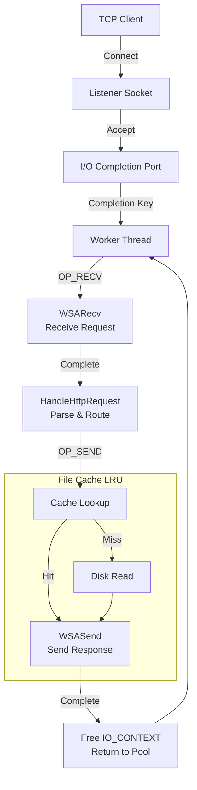

# Win64-httpdLite

A minimal, educational HTTP server written in x86-64 assembly language for Windows, demonstrating core networking, threading, and caching concepts without reliance on high-level frameworks.

[](https://en.wikipedia.org/wiki/X86-64)
[](https://www.microsoft.com/windows)
[](https://learn.microsoft.com/windows/win32/fileio/i-o-completion-ports)
[](https://en.wikipedia.org/wiki/Cache_(computing))
[](#license)

The server implements a subset of HTTP/1.1 using Windows native APIs (Winsock2, IOCP) and serves static files from a directory. It is intentionally concise (~1,800 lines of assembly) to serve as a learning tool for systems programming, concurrency, and low-level optimization.

---

## Features

| Feature | Description |
| --- | --- |
| HTTP/1.1 subset | Handles `GET`, `HEAD`, `POST`, `PUT`, `PATCH`, `DELETE` methods; returns appropriate status codes (200, 204, 400, 404, 405, 500) |
| Static file serving | Maps URLs to files under a configurable document root (`html/` by default) with MIME-type detection via extension |
| Binary cache | Simple LRU-linked list cache (configurable size) for frequently accessed files, reducing disk I/O |
| Thread pool | Uses Windows I/O Completion Ports (IOCP) with a worker thread count based on CPU cores (`NumProcessors * 2`) |
| Memory pool | Fixed-size SLIST allocator for `IO_CONTEXT` structures to minimize heap fragmentation and allocation overhead |
| Concurrent stress testing | Includes Python test suites for HTML correctness, HTTP methods, and resource delivery under load |
| Educational focus | No external dependencies beyond the Windows SDK; all logic is visible in the source |

---

## Technical Highlights

### 1. IOCP-driven concurrency

The server uses a single I/O Completion Port to manage dozens of concurrent connections with minimal context switching. Worker threads block on `GetQueuedCompletionStatus` and dispatch based on the operation type (`OP_RECV`, `OP_SEND`) stored in the per-connection `IO_CONTEXT`.

- **Worker count:** `NUMBER_OF_PROCESSORS * 2` (hardcoded in `main.asm` via `GetSystemInfo`).
- **Per-connection state:** `IO_CONTEXT` holds the socket, buffer, operation type, and WSABUF for overlapped I/O.
- **Zero-copy design:** Buffers are reused after being returned to the memory pool; no unnecessary data copying.

### 2. Lock-free SLIST allocator

To avoid heap allocation overhead during high concurrency, the server pre-allocates a pool of `IO_CONTEXT` structures and manages them with a singly-linked list (SLIST) accessed via `InterlockedPushEntrySList` and `InterlockedPopEntrySList`. This eliminates mutex contention for context allocation and freeing.

### 3. Simple LRU cache

A doubly-linked list (implemented manually) caches recently served file contents. On a cache hit, the server sends the cached data directly; on a miss, it reads from disk, caches the result, and evicts the least-recently-used entry if the cache exceeds its limit.

- **Cache structure:** `CacheEntry` (filename, file data, size) linked via `Next` pointers.
- **LRU policy:** On hit, move entry to front; on insertion, add to front and remove tail if over limit.
- **Thread safety:** Cache access is guarded by a critical section (not shown in snippets; full implementation uses a lock for simplicity in the educational context).

### 4. MIME-type resolution

The server reads `httpd.conf` at startup to build a mapping of file extensions to MIME types. If no match is found, it defaults to `application/octet-stream`. The configuration is parsed into a linked list scanned on each request.

---

## System Architecture

The request lifecycle is an overlapped I/O loop driven by IOCP:


```mermaid
flowchart TD
    Client[TCP Client] -->|Connect| Listener[Listener Socket]
    Listener -->|Accept| IOCP["I/O Completion Port"]
    IOCP -->|Completion Key| Worker[Worker Thread]
    Worker -->|OP_RECV| Recv[WSARecv<br/>Receive Request]
    Recv -->|Complete| Handler[HandleHttpRequest<br/>Parse & Route]
    Handler -->|OP_SEND| Lookup[Cache Lookup]
    subgraph Cache["File Cache LRU"]
        Lookup -->|Hit| Send[WSASend<br/>Send Response]
        Lookup -->|Miss| Dir[Disk Read]
        Dir --> Send
    end
    Send -->|Complete| Cleanup[Free IO_CONTEXT<br/>Return to Pool]
    Cleanup --> Worker
```

---

## Project Structure

```text
Win64-httpdLite/
├── src/
│   ├── main.asm             # Entry point: Winsock init, listener, IOCP, thread pool
│   ├── handler.asm          # IOCP worker loop: dispatch recv/send to HTTP handler
│   ├── http.asm             # HTTP parsing: request line, headers, path sanitization
│   ├── cache.asm            # File cache: LRU linked list, lookup, insertion
│   ├── memory.asm           # Memory pool: SLIST allocator for IO_CONTEXT
│   └── network.asm          # Winsock helpers: socket setup, bind, listen, TCP_NODELAY
├── html/                    # Static document root (served files)
│   ├── index.html
│   └── httpdLite.png
├── httpd.conf               # MIME type configuration (extension → type)
├── build.bat                # Build: nasm → link → executable
├── run_tests.bat            # Run all test suites
├── test_html.py             # Correctness: GET / returns index.html
├── test_methods.py          # Method safety: GET/HEAD/PUT/etc. return expected codes
└── test_resources.py        # Binary serving: Content-Type and byte accuracy
```

Key source files:

- **`src/main.asm`** — Initializes Winsock, creates the listener socket, binds to port 8080, creates the IOCP, and starts worker threads.
- **`src/network.asm`** — Contains `InitNetwork`, `EnableNoDelay`, and `CreateListener` wrappers around Winsock2.
- **`src/handler.asm`** — The `WorkerThread` procedure: loops on `GetQueuedCompletionStatus`, checks bytes transferred, and dispatches to `HandleHttpRequest` (in `http.asm`) for `OP_RECV` or prepares `OP_SEND`.
- **`src/http.asm`** — Parses the request line (`ParsePath`), validates the method, builds the response headers, and triggers a file read (via cache or disk).
- **`src/cache.asm`** — Implements `FindCacheEntry` (LRU lookup) and `CacheFile` (insertion with eviction).
- **`src/memory.asm`** — Provides `AllocContext` (pop from SLIST or heap) and `FreeContext` (push to SLIST).

---

## Reference: HTTP Response Table

The server returns the following status codes for the documented methods (tested via `test_methods.py`):

| Method | Success Condition | Response |
| --- | --- | --- |
| `GET` | File exists and readable | `200 OK` + `Content-Type` + `Content-Length` + file body |
| `HEAD` | Same as GET | `200 OK` + headers (no body) |
| `POST` | Not implemented (treated as unsupported) | `405 Method Not Allowed` |
| `PUT` | Not implemented | `405 Method Not Allowed` |
| `PATCH` | Not implemented | `405 Method Not Allowed` |
| `DELETE` | Not implemented | `405 Method Not Allowed` |
| Any | File not found | `404 Not Found` |
| Any | Invalid request line (e.g., missing space) | `400 Bad Request` |
| Any | Internal error (allocation failure, etc.) | `500 Internal Server Error` |

---

## Configuration

Configuration is minimal and set at build time or via plain text files.

| Item | Location | Description |
| --- | --- | --- |
| Document root | `html/` directory | Static files are served from this folder; no path traversal allowed |
| MIME types | `httpd.conf` | Lines of `extension=type` (e.g., `html=text/html`, `png=image/png`) |
| Listening port | `main.asm` (via `PORT` equ) | Default `8080`; change and rebuild to modify |
| Worker thread count | `main.asm` | Calculated as `GetSystemInfo` → `dwNumberOfProcessors * 2` |
| Cache limit | `cache.asm` (via `CACHE_LIMIT` equ) | Maximum number of cached entries (default `50`) |

---

## Building and Running

### Prerequisites

- **NASM** (Netwide Assembler) for assembling `.asm` files
- **GoLink** or Microsoft `link.exe` for linking the object files into a PE executable
- **Windows 10+** (or Windows Server) with the Windows SDK
- **Python 3+** (for running the test suites)

### Build

```bash
.\build.bat
```

This assembles all source files, links them, and produces `httpdLite.exe` in the project root.

### Run the server

```bash
httpdLite.exe
```

The server will start and listen on `127.0.0.1:8080` (configurable via changing the `PORT` equ in `main.asm` and rebuilding).

### Run the test suite

```bash
.\run_tests.bat
```

This executes:
- `test_html.py`: verifies `GET /` returns the expected `index.html` bytes and headers.
- `test_methods.py`: checks each HTTP method (`GET`, `HEAD`, `POST`, etc.) for correct status and (where applicable) body.
- `test_resources.py`: ensures binary files (e.g., `httpdLite.png`) are served with correct `Content-Type` and byte accuracy.

All tests must pass for a valid build.

---

## License

MIT License — see [LICENSE](LICENSE).